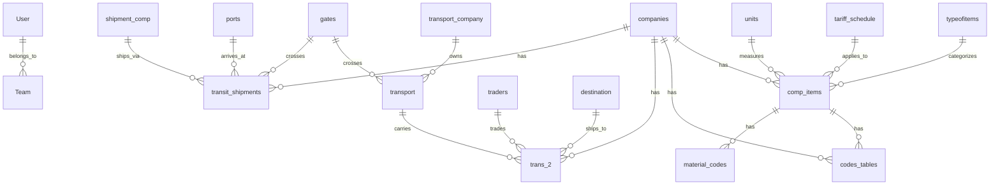

# Transit Logistics System — Frontend & Dashboard Implementation Plan

Build a professional RTL (Arabic) dashboard for the Transit Logistics System using **shadcn/ui**, **Recharts**, and **Lucide React** on top of the existing Next.js 16 + Prisma 7 + TailwindCSS 4 backend.

## Google Stitch Designs

The project has been listed on Google Stitch as **transit_ui2** — Project ID `2823559285566530073`

3 screens were generated:

- **Dashboard Overview** — KPI cards, shipment chart, recent shipments table
- **Login Page** — Split layout with illustration + form
- **Shipments Management** — Full CRUD table with filters
- **Document Management with AI Chat** — Upload area, document list, embedded AI chat panel

---

## Database Schema Summary

| Domain             | Models                                                                                                                                                       | Purpose                              |
| ------------------ | ------------------------------------------------------------------------------------------------------------------------------------------------------------ | ------------------------------------ |
| **Auth/RBAC**      | [User](file:///d:/e-comm/fullstackpostgres/app/types/index.ts#8-19), [Team](file:///d:/e-comm/fullstackpostgres/app/types/index.ts#20-29)                                                                                                                                               | ADMIN/MANAGER/USER/GUEST roles       |
| **Core Logistics** | `transit_shipments`, `transport`, `trans_2`                                                                                                                  | Shipment tracking, transport records |
| **Business**       | `companies`, `comp_items`, `traders`                                                                                                                         | Companies, products, trade partners  |
| **Reference**      | `gates`, `ports`, `depots`, `units`, `typeofitems`, `tariff_schedule`, `destination`, `transport_company`, `shipment_comp`, `codes_tables`, `material_codes` | Lookups and configuration            |

---

## User Review Required

> [!IMPORTANT]
> This plan uses **shadcn/ui** (requires Tailwind v4 compatibility via `shadcn@canary`). Since the project uses **TailwindCSS v4**, we'll use the canary version that supports it.

> [!IMPORTANT]
> The plan assumes **Arabic RTL** as the primary language direction (matching the existing [layout.tsx](file:///d:/e-comm/fullstackpostgres/app/layout.tsx) which sets `lang="ar" dir="rtl"`).

> [!WARNING]
> The existing [page.tsx](file:///d:/e-comm/fullstackpostgres/app/page.tsx) (home page) has the default Next.js boilerplate. It will be replaced with a redirect to `/login` or `/dashboard` based on auth state.

---

## Proposed Changes

### 1. Foundation Setup

#### [MODIFY] [package.json](file:///d:/e-comm/fullstackpostgres/package.json)

Install new dependencies:

- `shadcn@canary` (init + components)
- `lucide-react` — icon library
- `recharts` — charts
- `@radix-ui/*` — installed automatically by shadcn
- `class-variance-authority`, `clsx`, `tailwind-merge` — utility libs for shadcn

#### [NEW] [components.json](file:///d:/e-comm/fullstackpostgres/components.json)

shadcn configuration file — generated by `npx shadcn@canary init`

#### [MODIFY] [globals.css](file:///d:/e-comm/fullstackpostgres/app/globals.css)

Add shadcn CSS variables (primary, secondary, accent, etc.) with a blue logistics theme

#### [NEW] [lib/utils.ts](file:///d:/e-comm/fullstackpostgres/app/lib/utils.ts)

`cn()` utility for conditional class merging (shadcn standard)

---

### 2. Shared UI Components (via shadcn)

Install these shadcn components:
`button`, `input`, `label`, `card`, `table`, `badge`, `dropdown-menu`, `dialog`, `select`, `tabs`, `avatar`, `separator`, `sheet`, `toast`, `skeleton`, `pagination`, `tooltip`

---

### 3. Auth Pages

#### [NEW] [app/(auth)/login/page.tsx](<file:///d:/e-comm/fullstackpostgres/app/(auth)/login/page.tsx>)

- Split-screen layout: illustration left, login form right
- Email + password inputs, "Remember me", Login button
- Calls `POST /api/auth/login`
- Redirects to `/dashboard` on success

#### [NEW] [app/(auth)/register/page.tsx](<file:///d:/e-comm/fullstackpostgres/app/(auth)/register/page.tsx>)

- Similar split layout with registration form
- Name, email, password, team code (optional)
- Calls `POST /api/auth/register`

#### [NEW] [app/(auth)/layout.tsx](<file:///d:/e-comm/fullstackpostgres/app/(auth)/layout.tsx>)

- Minimal layout without sidebar/header for auth pages

---

### 4. Dashboard Layout

#### [NEW] [app/dashboard/layout.tsx](file:///d:/e-comm/fullstackpostgres/app/dashboard/layout.tsx)

- Sidebar + header + main content area wrapper
- Auth guard: redirect to `/login` if not authenticated

#### [NEW] [app/components/dashboard/Sidebar.tsx](file:///d:/e-comm/fullstackpostgres/app/components/dashboard/Sidebar.tsx)

- Collapsible dark sidebar (RTL: right side)
- Nav items: Dashboard, Shipments, Companies, Products, Transport, Traders, Users, Settings
- Active state indicator, icons from Lucide

#### [NEW] [app/components/dashboard/Header.tsx](file:///d:/e-comm/fullstackpostgres/app/components/dashboard/Header.tsx)

- Search input, notification bell, user avatar dropdown
- Logout action, profile link

---

### 5. Dashboard Home Page

#### [MODIFY] [app/dashboard/page.tsx](file:///d:/e-comm/fullstackpostgres/app/dashboard/page.tsx)

- 4 KPI stat cards: Total Shipments, Active Transport, Companies, Pending Deliveries
- Shipment statistics line chart (Recharts)
- Recent shipments data table

---

### 6. CRUD Data Pages

#### [NEW] [app/dashboard/shipments/page.tsx](file:///d:/e-comm/fullstackpostgres/app/dashboard/shipments/page.tsx)

- Full data table with filters (status, company, date range, port)
- Add/Edit shipment dialog form
- Status badges (pending, in-transit, delivered, cancelled)

#### [NEW] [app/dashboard/companies/page.tsx](file:///d:/e-comm/fullstackpostgres/app/dashboard/companies/page.tsx)

- Companies list with search
- Company details with associated items/shipments

#### [NEW] [app/dashboard/products/page.tsx](file:///d:/e-comm/fullstackpostgres/app/dashboard/products/page.tsx)

- Product items (comp_items) table
- Filter by company, type, unit

#### [NEW] [app/dashboard/transport/page.tsx](file:///d:/e-comm/fullstackpostgres/app/dashboard/transport/page.tsx)

- Transport records with driver info, plates, dates

#### [NEW] [app/dashboard/traders/page.tsx](file:///d:/e-comm/fullstackpostgres/app/dashboard/traders/page.tsx)

- Traders list with codes and associated transactions

#### [NEW] [app/dashboard/users/page.tsx](file:///d:/e-comm/fullstackpostgres/app/dashboard/users/page.tsx)

- User management (Admin/Manager only)
- Role assignment, team assignment
- Uses existing `/api/user` endpoints

---

### 7. API Routes (New)

#### [NEW] [app/api/shipments/route.ts](file:///d:/e-comm/fullstackpostgres/app/api/shipments/route.ts)

- [GET](file:///d:/e-comm/fullstackpostgres/app/api/health/route.ts#5-15) — List shipments with filters + pagination
- [POST](file:///d:/e-comm/fullstackpostgres/app/api/auth/register/route.ts#6-79) — Create new shipment (admin/manager)

#### [NEW] [app/api/shipments/[id]/route.ts](file:///d:/e-comm/fullstackpostgres/app/api/shipments/%5Bid%5D/route.ts)

- [GET](file:///d:/e-comm/fullstackpostgres/app/api/health/route.ts#5-15) — Single shipment details
- [PATCH](file:///d:/e-comm/fullstackpostgres/app/api/user/%5BuserId%5D/team/route.ts#7-37) — Update shipment
- `DELETE` — Delete shipment

#### [NEW] [app/api/companies/route.ts](file:///d:/e-comm/fullstackpostgres/app/api/companies/route.ts)

- [GET](file:///d:/e-comm/fullstackpostgres/app/api/health/route.ts#5-15) — List companies

#### [NEW] [app/api/products/route.ts](file:///d:/e-comm/fullstackpostgres/app/api/products/route.ts)

- [GET](file:///d:/e-comm/fullstackpostgres/app/api/health/route.ts#5-15) — List comp_items with company/type filters

#### [NEW] [app/api/transport/route.ts](file:///d:/e-comm/fullstackpostgres/app/api/transport/route.ts)

- [GET](file:///d:/e-comm/fullstackpostgres/app/api/health/route.ts#5-15) — List transport records

#### [NEW] [app/api/traders/route.ts](file:///d:/e-comm/fullstackpostgres/app/api/traders/route.ts)

- [GET](file:///d:/e-comm/fullstackpostgres/app/api/health/route.ts#5-15) — List traders

#### [NEW] [app/api/dashboard/stats/route.ts](file:///d:/e-comm/fullstackpostgres/app/api/dashboard/stats/route.ts)

- [GET](file:///d:/e-comm/fullstackpostgres/app/api/health/route.ts#5-15) — Aggregated dashboard KPIs (counts, totals)

---

### 8. Home Page Redirect

#### [MODIFY] [app/page.tsx](file:///d:/e-comm/fullstackpostgres/app/page.tsx)

- Replace Next.js boilerplate with auth-aware redirect:
  - Authenticated → `/dashboard`
  - Not authenticated → `/login`

---

## Verification Plan

### Browser Testing

1. **Run dev server**: `npm run dev` at `d:\e-comm\fullstackpostgres`
2. **Login flow**: Navigate to `http://localhost:3000/login`, enter credentials, verify redirect to dashboard
3. **Dashboard**: Verify KPI cards load data, chart renders, recent shipments table shows data
4. **Navigation**: Click each sidebar item, verify correct page loads
5. **Shipments CRUD**: Add, edit, delete a shipment from the UI
6. **RTL layout**: Verify all text is right-aligned, sidebar is on the right
7. **Responsive**: Resize browser to test mobile/tablet layouts
8. **Auth guard**: Visit `/dashboard` while logged out, verify redirect to `/login`

### Manual Verification

- After implementation, I will use the browser tool to navigate all pages and capture screenshots for validation
